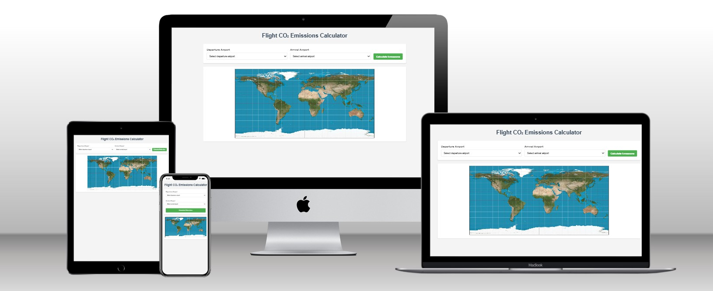
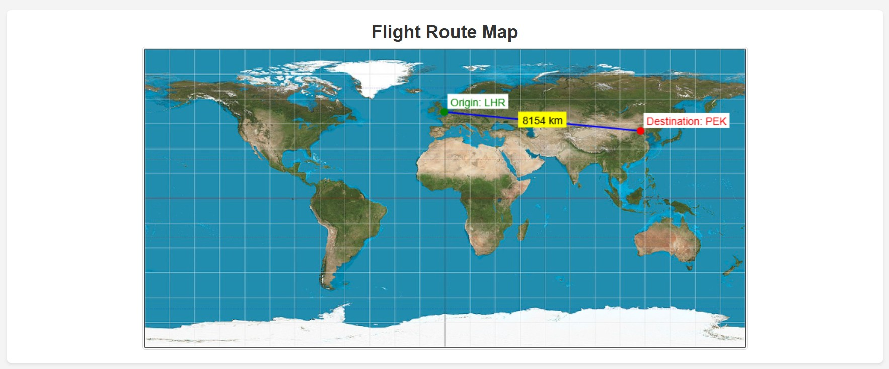
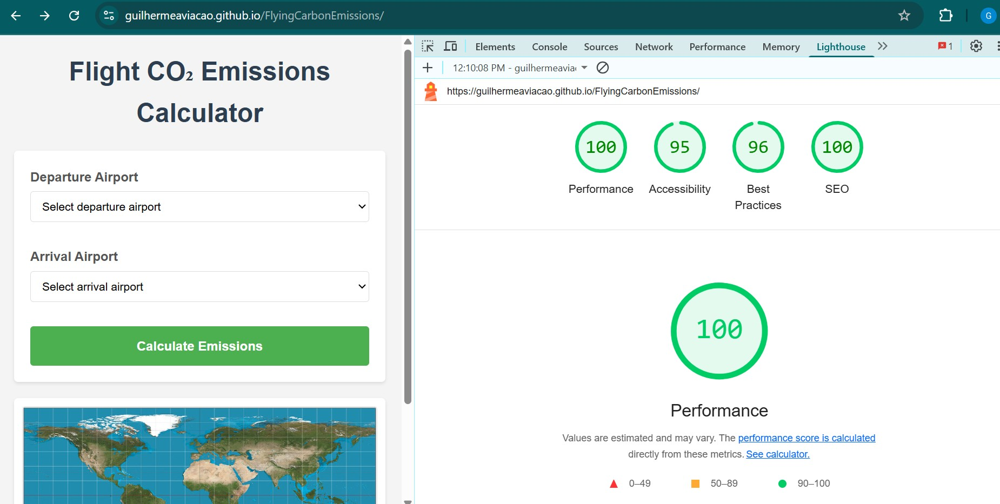
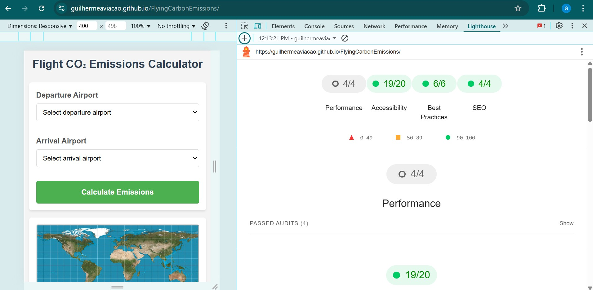
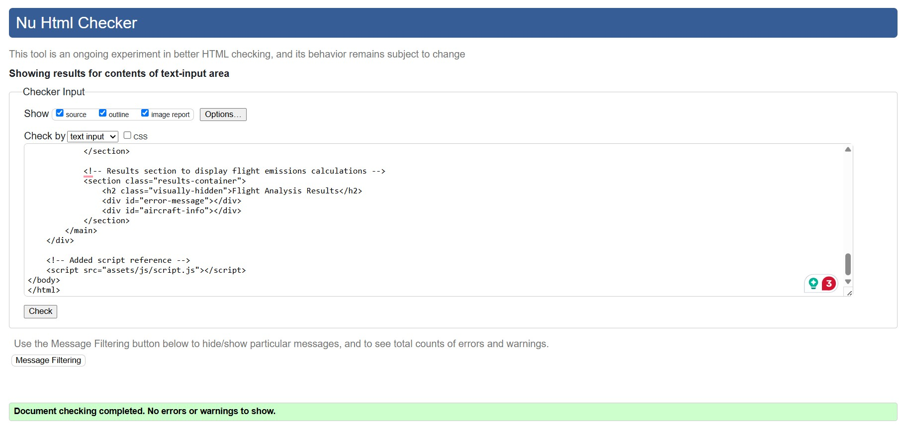
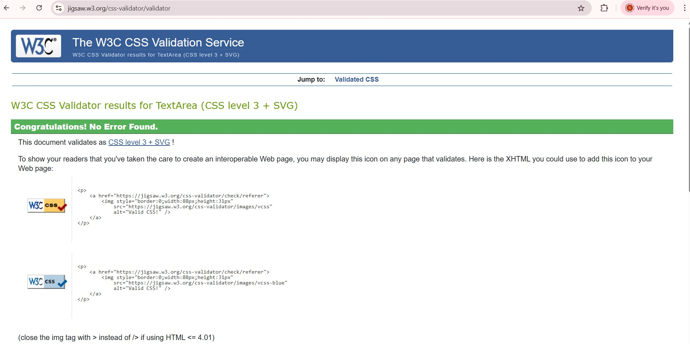
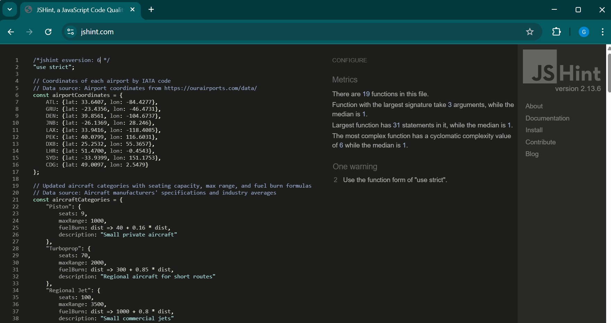

# Flight CO₂ Emissions Calculator

A web app in Html/Css/Javascript that calculates and visualizes the carbon dioxide emissions for flights between  airports, on a total and per seat basis, helping its users understand the environmental impact of air travel.

## Overview

## Features
### Airport Selection
User-friendly dropdown menus for selecting departure and arrival airports
Visual indication of origin and destination on the map

### Route Mapping
Track display between origin and destination
Great-circle distance calculation using the Haversine formula, results in Km

### Aircraft Selection
Most suitable aircraft for the distance selection
Display of its technical caracteristics and fuel consumption for the route

### Route Emissions
Display of route carbon emissions based on industry standard rules (3.16 kg of CO2 per 1kg of Jet Fuel)
Per seat/passenger depiction of carbon emissions

## Technologies

HTML
Javascript
CSS

## Testing
Performance and acessibility
High performance marks in the responsive version for mobile, Lighthouse results:

HTML
No errors were returned when passing through the official W3C validator:
CSS
No errors were found when passing through the official (Jigsaw) validator:
Javascript
No major errors were found when passing through the JSHint validator:

## Development Process

## Future Enhancements
Add more airports to expand global coverage
Aircraft selection by the user
Linking to carbon emissions compensation projects

## Deployment
The site was deployed to GitHub pages. The steps to deploy are as follows:

In the GitHub repository, navigate to the Settings tab
From the source section drop-down menu, select the Master Branch
Once the master branch has been selected, the page will be automatically refreshed with a detailed ribbon display to indicate the successful deployment.
The live link can be found here - https://guilhermeaviacao.github.io/FlyingCarbonEmissions/

## Credits
Project inspired by gcmap.com, available on:
http://gc.kls2.com/faq.html#$gc-calc

Haversine formula implementation inspired by Movable Type Scripts, available on: https://www.movable-type.co.uk/scripts/latlong.html

Canvas API techniques referenced from MDN Web Docs, available on: https://developer.mozilla.org/en-US/docs/Web/API/Canvas_API

Readme template from Code Institute, available on: https://github.com/Code-Institute-Solutions/readme-template

### Content
Majority of the content from the first submission of the project, available on: https://github.com/Guilherme-S-Brito/Flying-Carbon-Emissions?tab=readme-ov-file

Airport coordinates data sourced from OurAirports, available on: https://ourairports.com/data/

### Media
World map in the Equirectangular projection from NASA Blue Marble imagery, available on:
https://en.wikipedia.org/wiki/Equirectangular_projection#/media/File:Equirectangular_projection_SW.jpg

### Thanks
To Code Institute Assessor on feedback of the first version of the project. Available on: https://github.com/Guilherme-S-Brito/Flying-Carbon-Emissions?tab=readme-ov-file